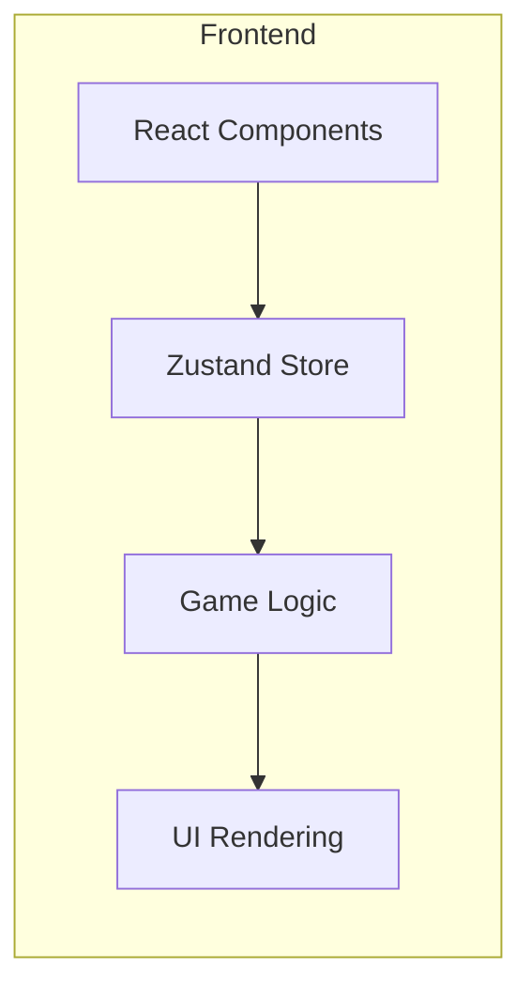
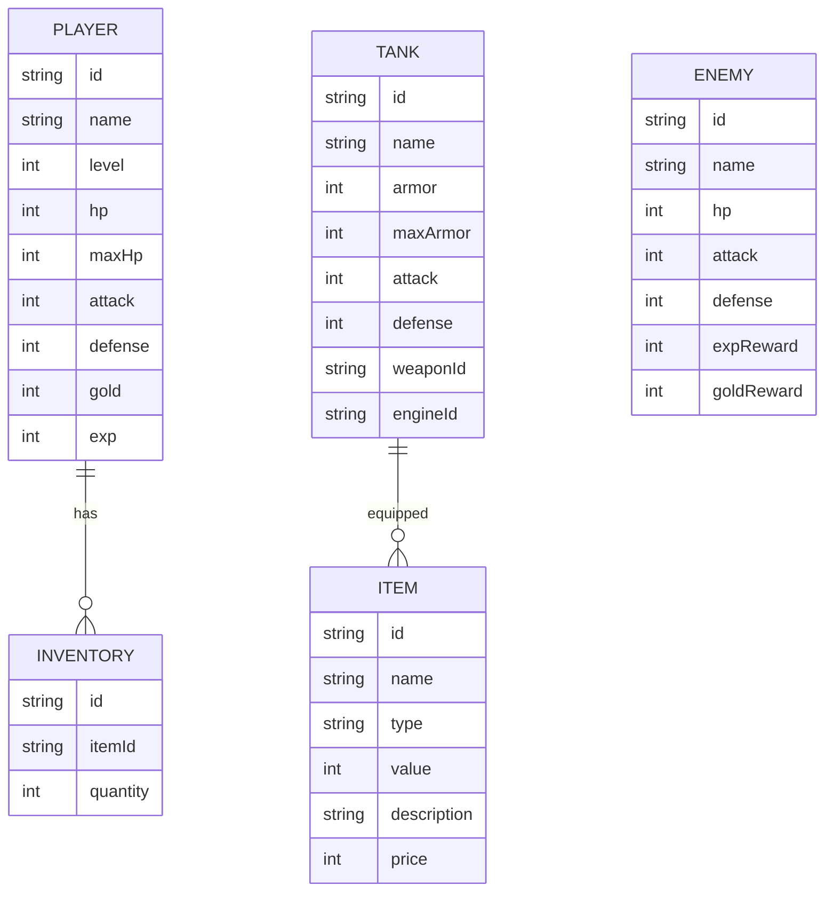

## 1. Architecture Design
纯前端应用，使用React + TypeScript + Vite构建，状态管理使用Zustand。



## 2. Technology Description
- Frontend: React@18 + TypeScript + Vite + Tailwind CSS
- State Management: Zustand
- Initialization Tool: vite-init
- Backend: None (纯前端应用)
- Database: LocalStorage (用于存档)

## 3. Route Definitions
| Route | Purpose |
|-------|---------|
| / | 游戏主界面 |

## 4. Data Model

### 4.1 Data Model Definition


### 4.2 Type Definitions
```typescript
interface Player {
  id: string;
  name: string;
  level: number;
  hp: number;
  maxHp: number;
  attack: number;
  defense: number;
  gold: number;
  exp: number;
}

interface Tank {
  id: string;
  name: string;
  armor: number;
  maxArmor: number;
  attack: number;
  defense: number;
  weapon?: Item;
  engine?: Item;
}

interface Item {
  id: string;
  name: string;
  type: 'weapon' | 'engine' | 'consumable' | 'armor';
  value: number;
  description: string;
  price: number;
}

interface Enemy {
  id: string;
  name: string;
  hp: number;
  maxHp: number;
  attack: number;
  defense: number;
  expReward: number;
  goldReward: number;
}

interface InventoryItem {
  item: Item;
  quantity: number;
}

interface GameState {
  player: Player;
  tank: Tank;
  inventory: InventoryItem[];
  currentLocation: string;
  gamePhase: 'explore' | 'battle' | 'shop' | 'inventory';
  battle?: {
    enemy: Enemy;
    turn: 'player' | 'enemy';
  };
  messageLog: string[];
}
```
