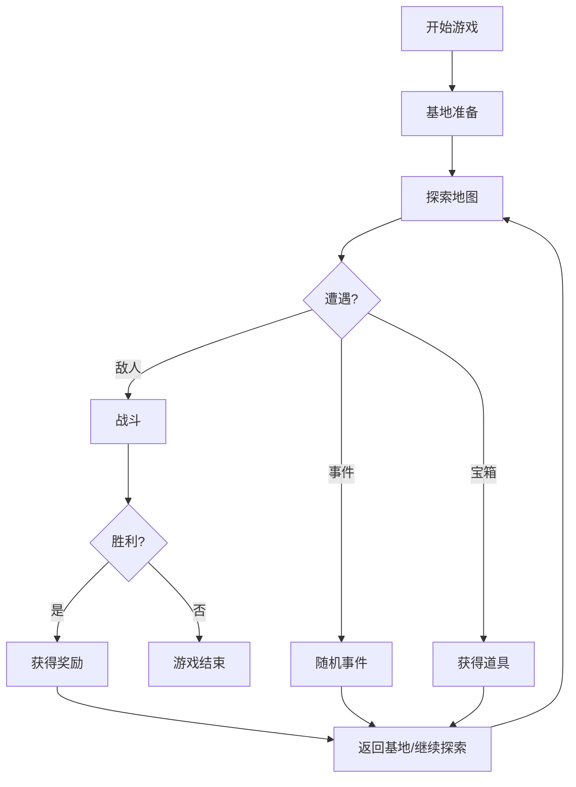

## 1. Product Overview
废土战歌是一款原创废土题材文字冒险游戏，玩家驾驶战车在废土世界中探索、战斗、收集装备。
- 主要目标：提供沉浸式的文字冒险体验，废土题材原创玩法
- 市场价值：为怀旧玩家提供经典游戏体验，同时吸引新玩家了解废土题材

## 2. Core Features

### 2.1 Feature Module
1. **游戏主界面**：场景展示、行动选择、状态面板
2. **探索系统**：地图移动、随机事件、道具收集
3. **战斗系统**：回合制战斗、战车/人物切换、技能使用
4. **背包系统**：道具管理、装备穿戴、物品使用
5. **商店系统**：购买装备、修理战车、恢复体力

### 2.3 Page Details
| Page Name | Module Name | Feature description |
|-----------|-------------|---------------------|
| 游戏主界面 | 场景展示 | 显示当前位置、环境描述、可执行选项 |
| 游戏主界面 | 状态面板 | 显示角色HP、战车装甲、金币、等级等信息 |
| 探索场景 | 地图移动 | 玩家选择方向进行探索 |
| 战斗界面 | 战斗系统 | 回合制战斗，选择攻击、技能、道具或逃跑 |
| 背包界面 | 物品管理 | 查看、使用、装备道具 |
| 商店界面 | 交易系统 | 购买物品、修理战车 |

## 3. Core Process
玩家从初始基地出发，探索不同区域，遭遇敌人进行战斗，收集金币和道具，升级战车和角色，最终挑战强大的BOSS。

## 4. User Interface Design
### 4.1 Design Style
- 主色调：深灰、铁锈红、军绿（废土风格）
- 按钮风格：矩形、硬朗边框、工业风格
- 字体：等宽字体（Courier/Monaco）搭配粗犷标题字体
- 布局风格：复古终端风格，分区清晰
- 图标：像素风格或简洁线条图标

### 4.2 Page Design Overview
| Page Name | Module Name | UI Elements |
|-----------|-------------|-------------|
| 游戏主界面 | 场景展示 | 深色背景，文字有打字机效果，边框装饰 |
| 游戏主界面 | 状态面板 | 绿色/红色状态条，网格布局 |
| 战斗界面 | 战斗系统 | 左右分栏显示玩家和敌人，技能按钮排列整齐 |
| 背包界面 | 物品管理 | 列表形式，可点击交互 |

### 4.3 Responsiveness
桌面端优先，适配不同屏幕尺寸，移动端保持核心功能可用。
